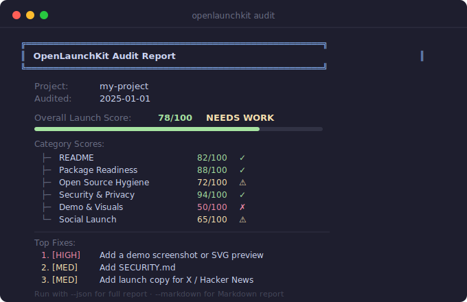

# OpenLaunchKit

[](https://www.npmjs.com/package/openlaunchkit)
[](https://github.com/stephenywilson/OpenLaunchKit/actions/workflows/ci.yml)
[](./LICENSE)

**Launch readiness auditor for AI-built GitHub projects.**

Before you publish, OpenLaunchKit helps you answer one question: does this repo look like a real, trustworthy open-source project, or does it still look like an unfinished AI-generated draft?

Run one command before you post on Hacker News, X, or npm:

```bash
npx openlaunchkit audit
```

No install required. No AI API. No telemetry. Runs fully locally.



---

## What It Checks

50+ static checks across 7 weighted categories:

| Category | Weight | Checks |
|----------|--------|--------|
| README quality | 25% | Title, tagline, Quick Start, code examples, screenshot, features, limitations |
| Package readiness | 20% | Non-generic name, version, keywords, `bin`/`files`/`exports`, repository, lockfile |
| Open source hygiene | 15% | LICENSE, CHANGELOG, CONTRIBUTING, SECURITY, .gitignore, CI workflow, tests |
| Security & privacy | 20% | No .env committed, no secrets/tokens, no local paths, no hidden Unicode, no install scripts |
| Demo & visuals | 10% | Screenshot or GIF in README, `assets/`, `docs/images/`, terminal output example |
| Social launch | 5% | `docs/launch/` with X/HN drafts, tweet-length tagline, value proposition bullets |
| AI red flags | 5% | No unfinished markers, no filler text, no fake CI badges, no AI boilerplate |

**What it does not claim:**
- It does not guarantee security
- It does not catch every secret
- It does not replace human review
- It does not guarantee launch success

---

## The Question This Answers

> "AI makes it easy to generate a repo, but hard to know whether it's actually ready to launch. OpenLaunchKit gives you a score and a fix list — locally, in seconds, with no external services."

---

## Quick Start

```bash
# Audit current directory
npx openlaunchkit audit

# Audit a specific project
npx openlaunchkit audit --path ./my-project

# Get a full JSON report
npx openlaunchkit audit --json

# Save a Markdown report
npx openlaunchkit audit --markdown --output report.md

# Create launch post templates in docs/launch/
npx openlaunchkit init-launch-docs
```

## Example Output

```text
╔══════════════════════════════════════════════════════════════╗
║                  OpenLaunchKit Audit Report                  ║
╚══════════════════════════════════════════════════════════════╝

  Project:  my-project
  Audited:  2025-01-01

  Overall Launch Score:  78/100  NEEDS WORK

  Category Scores:
  ├─ README                     82/100  ✓
  ├─ Package Readiness          88/100  ✓
  ├─ Open Source Hygiene        72/100  ⚠
  ├─ Security & Privacy         94/100  ✓
  ├─ Demo & Visuals             50/100  ✗
  ├─ Social Launch              65/100  ⚠
  └─ AI Red Flags               80/100  ✓

  Top Fixes:
  1. [HIGH]     Add a demo screenshot or generated SVG preview.
  2. [MEDIUM]   Add SECURITY.md.
  3. [MEDIUM]   Add launch copy for X / Hacker News.
  4. [LOW]      Add GitHub Actions CI workflow.
  5. [LOW]      Add docs/launch/x-post.md launch template.

  Run with --json for full report, --markdown for Markdown report.
```

---

## All CLI Options

```bash
npx openlaunchkit audit                          # Terminal report, current directory
npx openlaunchkit audit --path ./my-project      # Specific path
npx openlaunchkit audit --json                   # Machine-readable JSON
npx openlaunchkit audit --markdown               # GitHub Markdown report
npx openlaunchkit audit --markdown --output report.md
npx openlaunchkit audit --no-fail                # Exit 0 even if score < 70 (CI advisory)
npx openlaunchkit init-launch-docs               # Create docs/launch/ templates
npx openlaunchkit version
npx openlaunchkit help
```

---

## Scoring

| Score | Status |
|-------|--------|
| 70–100 | Launch Ready |
| 60–69 | Needs Work |
| 0–59 | Not Ready |

Exit code is `1` if score < 70 (override with `--no-fail`).

---

## Why This Exists

AI coding tools like Cursor, Copilot, and Claude can scaffold a project in minutes. But the README often comes out as a template with unfilled sections, local paths from the developer's machine leak into docs, security files are missing, and screenshots are promises rather than reality.

OpenLaunchKit is the final check before you post "Show HN: I built X" — making sure you don't embarrass yourself by shipping an obviously unfinished repo.

---

## Comparison

| Tool | What it does |
|------|-------------|
| `np` | Publishes npm packages safely |
| `release-it` | Automates release workflow |
| `standard-version` | Manages changelogs and versions |
| **OpenLaunchKit** | Audits project quality before you publicize it |

OpenLaunchKit doesn't replace any of these — it runs **before** you use them.

---

## Limitations

- Reads local files only — does not fetch from GitHub or npm
- Secret detection uses patterns and may have false positives or miss obfuscated secrets
- Does not run or build your code — static analysis only
- Cannot verify that demo images actually render at referenced URLs
- package.json analysis assumes npm/yarn/pnpm

## Roadmap

- v0.2.0: GitHub API integration (repo topics, description, website)
- v0.2.0: `--fix` flag to auto-generate missing files
- v0.3.0: npm registry name availability check
- v0.3.0: Broken link detection in README

## Example Markdown Report

See [docs/examples/sample-report.md](./docs/examples/sample-report.md) for a full example report.

## License

MIT — see [LICENSE](./LICENSE)

---

Made with OpenLaunchKit: `npx openlaunchkit audit`
